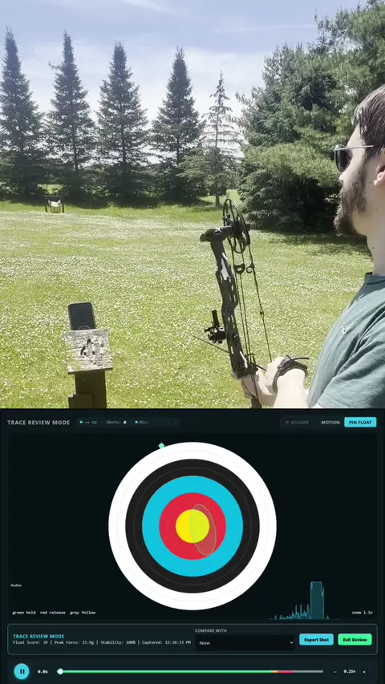
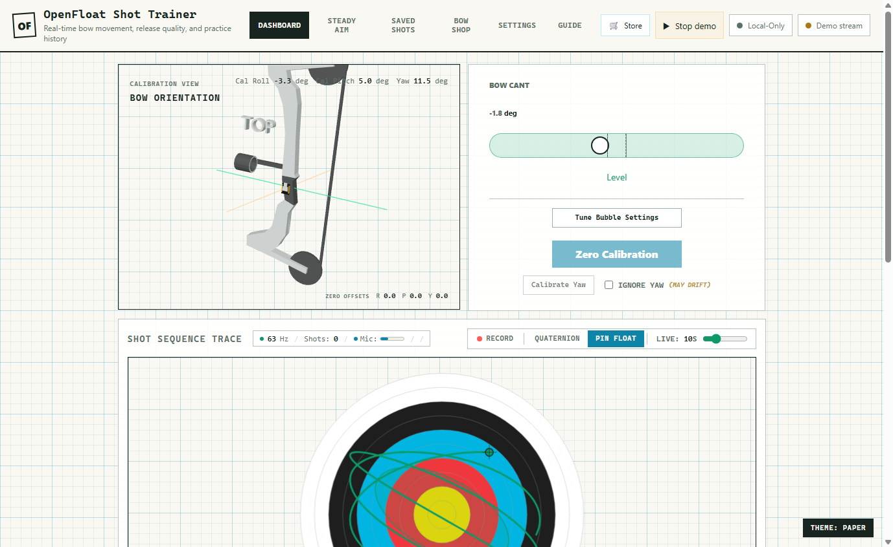
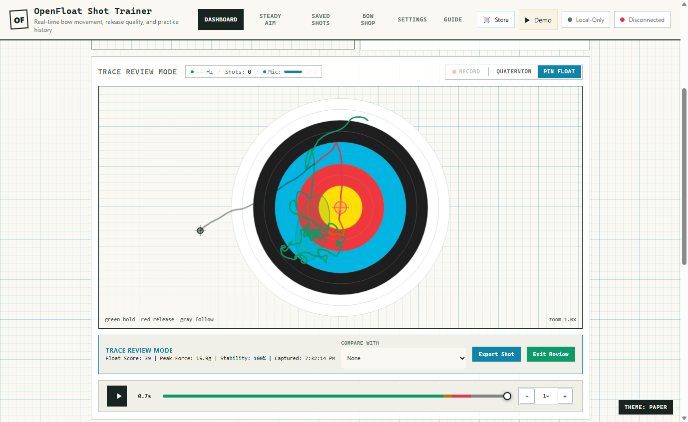
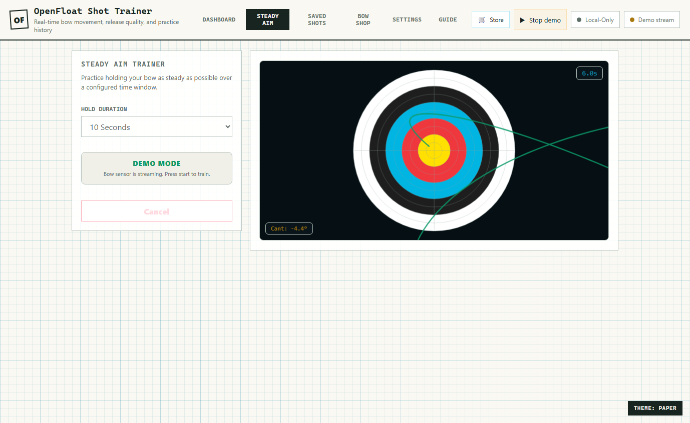

# OpenFloat Archery

[](https://github.com/DevanMetz/Open-Float-Archery/actions/workflows/ci.yml)
[](https://github.com/DevanMetz/Open-Float-Archery/actions/workflows/firmware.yml)

**Open-source bow telemetry you can build in an afternoon and run entirely in
your browser.** OpenFloat pairs a tiny BLE sensor (Seeed XIAO nRF54L15 Sense,
Zephyr/NCS firmware) with a local-first web dashboard that streams ~1110 Hz IMU
data, detects shots, and scores aiming hold, release, and follow-through — no
app store, no account, and no cloud required.

🌐 **Hosted app:** [openfloatarchery.com](https://openfloatarchery.com) ·
🚀 **[Quick Start](docs/quick-start.md)** ·
🧩 **[Feature Status](docs/feature-status.md)** ·
🏗 **[Architecture Blueprint](Blueprint.md)** ·
🎛 **[BLE Commands](docs/reference/ble-commands.md)**

<p align="center">
  
</p>

---

## Try It — No Hardware Needed

The hosted app at **[openfloatarchery.com](https://openfloatarchery.com)** loads
with demo shots from real OpenFloat captures, so you can explore shot review,
replay, scoring, and session analysis before building anything. It runs fully
offline once loaded (PWA).

**Already have a sensor?** Serve the repo root over localhost so native ES
modules and Web Bluetooth are available, then open it in Chrome or Edge:

```powershell
python -m http.server 4178
```

```text
http://localhost:4178/
```

Connect the sensor from the status badge in the header to start streaming live
telemetry.

**Building a sensor from scratch?** The [Quick Start](docs/quick-start.md) walks
through the ~1 hour first build: parts list, firmware toolchain, flashing, and
first calibration. Firmware build/flash/verify detail lives in
[`firmware/BUILDING.md`](firmware/BUILDING.md).

<!-- 📸 IMAGE SPOT 2 of 5 — SENSOR PHOTO — docs/images/sensor-mounted-riser.jpg
     A clear, well-lit photo of the XIAO sensor mounted on your bow's riser
     (or stabilizer). Show scale — the whole point is how tiny it is.
     Suggested: ~1200 px wide JPG.
     When ready, delete this comment and uncomment the line below. -->
<!--  -->

## What It Does

A short tour of the shipped capabilities — see **[Feature Status](docs/feature-status.md)**
for the full, detailed inventory and **[Blueprint.md](Blueprint.md)** for
architecture and design intent.

**Firmware** runs the LSM6DS3TR-C at 3332 Hz ODR via an interrupt-driven FIFO
watermark, averaging to a ~1110 Hz BLE stream of 20-byte live frames carrying
8-bit accel, on-device Madgwick quaternions, and an on-chip microphone envelope
byte. It
detects shots with a recoil-validated impulse threshold, persists a lifetime
shot count and the newest 100 shot records to RRAM, and replays buffered traces
to the browser on reconnect. The default config is battery-safe; a UART overlay
adds USB bench logs.

**Browser dashboard** is local-first and offline-capable (PWA). It consumes the
firmware Madgwick quaternion directly for live orientation, derives Euler
readouts for compatibility with scoring and saved traces, and renders a
calibrated bubble level and 3D bow visualizer, phase-colored Pin Float shot
review with replay scrubber and shot comparison, an independent open-source
0–100 Float Score, Steady Aim hold training, automatic practice-session
grouping, a Bow Shop 3D customizer, full local backup/restore, and an optional
self-hosted Supabase sync that never gates local use.

<!-- 📸 IMAGE SPOT 3 of 5 — LIVE DASHBOARD — docs/images/dashboard-live.png
     Screenshot of the dashboard while connected and streaming: bubble level,
     3D bow visualizer, live rate (~1110 Hz), and the acoustic envelope meter
     visible in the header. Suggested: full-window PNG, ~1400 px wide.
     When ready, delete this comment and uncomment the line below. -->
<!--  -->

<!-- 📸 IMAGE SPOT 4 of 5 — SHOT REVIEW — docs/images/shot-review-pin-float.png
     Screenshot of Pin Float trace review on a saved shot: phase-colored trace
     (green hold / amber-red release / gray follow-through), 1-sigma ellipse,
     release reticle, replay scrubber, and the Float Score breakdown.
     When ready, delete this comment and uncomment the line below. -->
<!--  -->

<!-- 📸 IMAGE SPOT 5 of 5 — TRAINING & SESSIONS — docs/images/steady-aim-session.png
     Screenshot of either the Steady Aim drill mid-hold (live tracing +
     steadiness scoring) or a Saved Shots session summary with the Float Score
     progression plot — whichever looks best. A side-by-side of both also
     works. When ready, delete this comment and uncomment the line below. -->
<!--  -->

## Repository Layout

- `index.html`, `styles.css`, `manifest.json`, and `service-worker.js` are the
  static browser app shell and PWA assets.
- `app/` contains native ES modules with no build step: protocol parsing,
  device adapters, IndexedDB storage, telemetry scoring/sync, and UI modules
  (dashboard, Steady Aim training, trace preview).
- `firmware/` is the Zephyr/NCS app for the Seeed XIAO nRF54L15 Sense. See
  `firmware/BUILDING.md` for build, flash, and verification instructions.
- `tools/` contains host-side validation utilities, including the BLE client and
  follow-through trace verifier.
- `Blender/` and `FreeCAD/` contain visual/mechanical assets used by the app and
  enclosure work.
- `docs/` is the documentation site source (Quick Start, Feature Status, and
  BLE command reference) plus the README images in `docs/images/`.
- `Blueprint.md` is the detailed architecture and implementation status.

## BLE Telemetry Test Client

The host-side BLE validation script is:

```text
tools/openfloat_ble_client.py
```

Install its Python dependency:

```powershell
python -m pip install bleak
```

On this Windows test host, Bleak may be installed in the local dependency folder
used during bring-up. If the script cannot import `bleak`, run commands with:

```powershell
$env:PYTHONPATH='C:\tmp\openfloat-pydeps'
```

On Windows, the client keeps the scanned BLE device object for name/prefix
matches before connecting, which is more reliable than reconnecting by address
alone. If an older persisted sleep timeout is still short, reset the module and
use a short scan timeout immediately after reset.

Verify delayed trace freeze behavior without hardware:

```powershell
python tools\verify_follow_through_trace.py
```

Scan for an OpenFloat BLE peripheral and print decoded telemetry:

```powershell
python tools\openfloat_ble_client.py --name-prefix OpenFloat --every
```

Run for 30 seconds and save decoded samples:

```powershell
python tools\openfloat_ble_client.py --duration 30 --csv openfloat_ble_capture.csv
```

Run a steady-state throughput validation (~1100 Hz) after BLE warm-up:

```powershell
$env:PYTHONPATH='C:\tmp\openfloat-pydeps'
python tools\openfloat_ble_client.py --name-prefix OpenFloat --scan-timeout 12 --duration 20 --warmup 5 --reset-command start
```

Verify the on-chip microphone envelope (serial PDM banner + optional BLE
`mic_amp` activity):

```powershell
$env:PYTHONPATH='C:\tmp\openfloat-pydeps'
python tools\verify_mic_envelope_rate.py --serial-port COM10 --openocd-serial 09EC6223
```

If the first firmware bring-up uses Nordic UART Service instead of the custom
OpenFloat GATT UUIDs, add `--nus`:

```powershell
python tools\openfloat_ble_client.py --nus --name-prefix OpenFloat --every
```

## Optional Cloud Sync

Cloud sync is optional and self-hosted; the app is fully usable local-only. To
enable it, supply a Supabase URL and anon key in the app's Cloud modal. The
authoritative, idempotent database schema (tables, columns, dedup index, and
row-level security policies) lives in
[`supabase/schema.sql`](supabase/schema.sql) — run that file in the Supabase SQL
editor. It matches exactly what `app/telemetry/sync.js` uploads, so keep it as
the single source of truth rather than copying SQL elsewhere; drift causes the
sync adapter to silently drop unknown columns.

## Support the Project

OpenFloat is free and open source. If it is useful to you, donations help fund
firmware development, hardware design, and hosting:

- **Donate via the store:** https://store.openfloatarchery.com/products/support-openfloat
- Or use the **Sponsor** button at the top of this repository.

There is also a **Support OpenFloat** card in the web app's Settings tab.

## Safety

OpenFloat Archery is an experimental, hobby/educational telemetry project, not a
safety device. Do not rely on it for any safety-critical decision. Always follow
normal archery range safety rules. Mount the sensor securely so it cannot become
a projectile or interfere with the bow; an improperly mounted accessory can fail
under release shock. You are responsible for the safe use of your equipment.

## License and Attribution

This project is licensed under the MIT License (see `LICENSE`); firmware sources
additionally carry `Apache-2.0` SPDX headers. Third-party software, algorithms,
and platform components are credited in `THIRD_PARTY_NOTICES.md`. If you
redistribute or build on this project, preserve upstream copyright and license
headers and keep the notices file accurate.

OpenFloat Archery is an independent, open-source project. It is not affiliated
with, endorsed by, or derived from any commercial archery-electronics product or
its maker, and all third-party product and company names are the property of
their respective owners.
